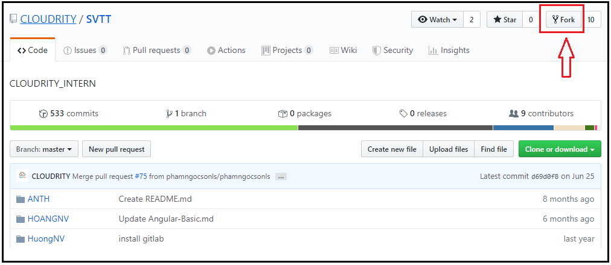
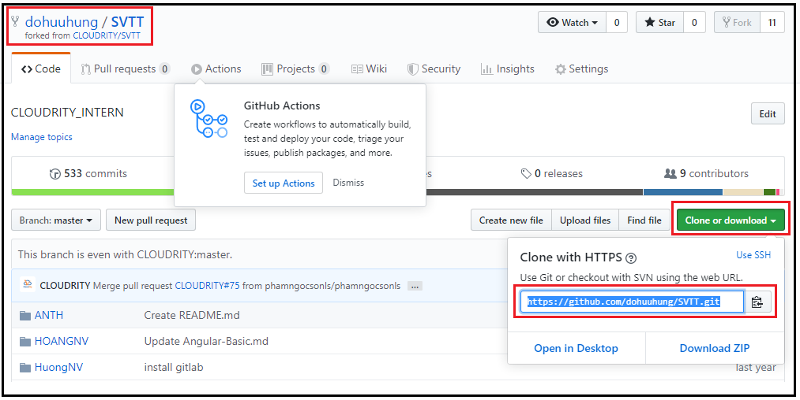
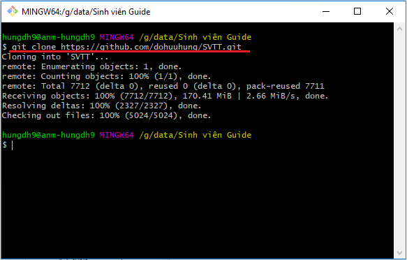
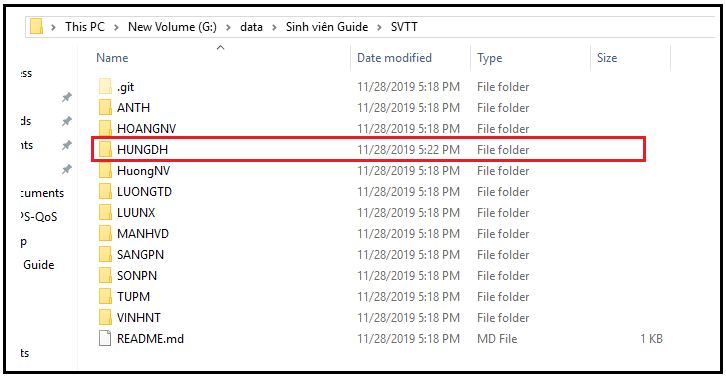
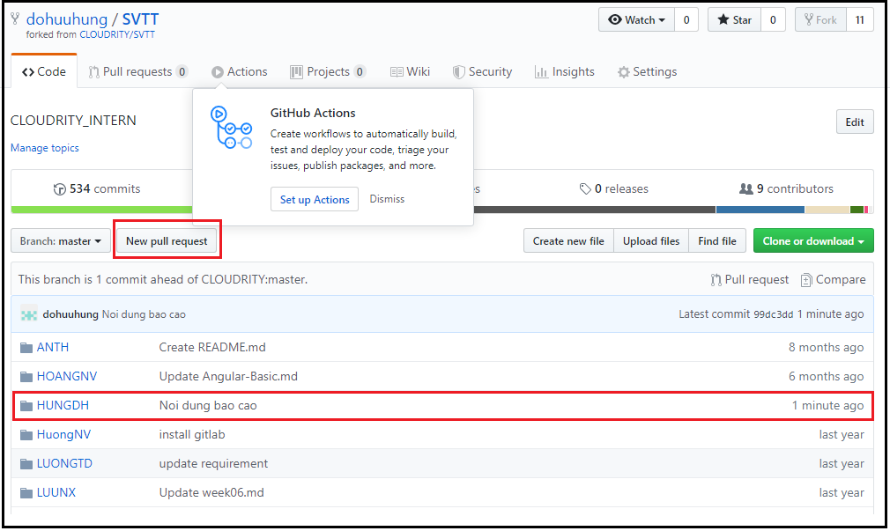
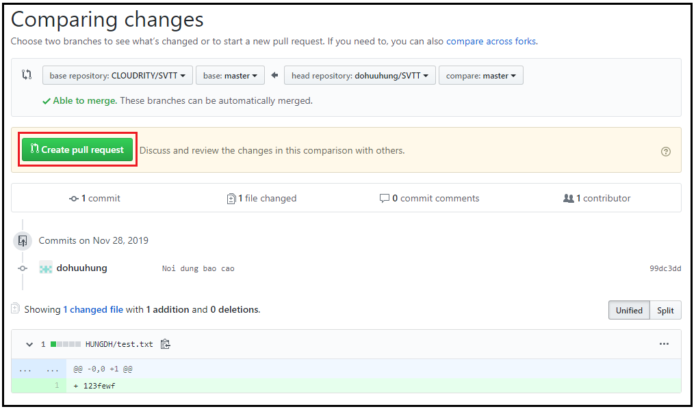
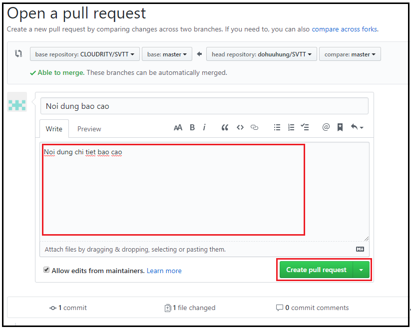

# CLOUD OPENSTACK GUIDE

## Chương 1. Tìm hiểu Cloud – Openstack
### 1.1.	Cloud computing
-	Khái niệm Cloud computing?
-	Tại sao cần sử dụng cloud? Lợi ích mà cloud đem lại?
-   Phân loại cloud? So sánh giữa các loại cloud khác nhau?
-   Top 10 nhà cung cấp dịch vụ, giải pháp cloud?
### 1.2.	Openstack
#### 1.2.1.	Openstack Overview
-   Tìm hiểu Openstack là gì?
-	Những nhà cung cấp dịch vụ, giải pháp cloud sử dụng Openstack?
#### 1.2.2.	Devstack
Trước khi đi vào tìm hiểu chi tiết những thành phần trong Openstack, chúng ta sẽ trải nghiệm cloud computing Openstack 
thông qua công cụ Devstack. Devstack là một bộ cài đặt do cộng đồng Openstack phát triển. Devstack hỗ trợ dựng môi 
trường development cho những nhà phát triển Openstack một cách nhanh chóng. Devstack sẽ cài đặt những dịch vụ tối 
thiểu để đem lại tính năng hoàn chỉnh như một cụm Openstack triển khai thông thường.

Yêu cầu:
-	Cài đặt Devstack All-in-One
*	Thực hiện các thao tác sau trên giao diện của Devstack:
     - Tạo, sửa, xóa project.
     - Tạo, sửa, xóa user trong project mới tạo bước trên.
     - Gán role admin cho user mới tạo.
     - Tạo, xóa network, subnet.
     - Tạo, xóa VM.
#### 1.2.3.	Những dịch vụ chính trong Openstack
Trong phần này, yêu cầu tìm hiểu chi tiết về chức năng, thành phần và cách hoạt động của những dịch vụ chính trong Openstack. 
Kết hợp việc tìm hiểu lý thuyết và thực hành với devstack đã cài đặt để làm rõ vấn đề.
##### 1.2.3.1.	Keystone
-	Keystone cung cấp chức năng gì?
-	Tìm hiểu các khái niệm: user, group, project, domain, role. Quan hệ giữa những khái niệm này?
-	Tìm hiểu cách quản lý và sử dụng Token trong môi trường Openstack. Các loại token: Fernet, UUID, PKI ?
-	Xác thực, phân quyền:
     - Tìm hiểu những kiểu xác thực mà Keystone cung cấp.
     -	Đưa ra luồng xác thực, phân quyền:
          - Khi user sử dụng một dịch vụ. Ví dụ: khi user tạo VM, tạo network, upload image …
          - Khi một dịch vụ sử dụng một dịch vụ khác. Ví dụ: khi Nova truy vấn tới Glance để lấy image tạo VM.
##### 1.2.3.2.	Nova
-	Chức năng chính của dịch vụ Nova?
-	Tìm hiểu các thành phần trong kiến trúc của Nova? Nhiệm vụ của từng thành phần?
-	Tìm hiểu backend của dịch vụ Nova?
-	Flavor là gì?
-	Workflow giữa các thành phần của Nova và dịch vụ bên ngoài trong kịch bản: tạo, xóa VM.
##### 1.2.3.3.	Neutron
-	Chức năng chính của dịch vụ Neutron?
-	Tìm hiểu các thành phần trong kiến trúc của Neutron? Nhiệm vụ của từng thành phần?
-	Tìm hiểu backend OpenvSwitch của dịch vụ Neutron?
-	Workflow giữa các thành phần kiến trúc của Neutron trong kịch bản sử dụng cơ bản: tạo, xóa network/subnet…
-	Tìm hiểu 2 kiểu mạng mà Neutron cung cấp, Provider network và Self-service network. Mỗi kiểu mạng, làm rõ luồng đi của gói tin bên dưới hạ tầng OpenvSwitch với kịch bản:
     - North - South
     - East - West
##### 1.2.3.4.	Cinder
-	Chức năng chính của dịch vụ Cinder?
-	Tìm hiểu các thành phần trong kiến trúc của Cinder? Nhiệm vụ của từng thành phần?
-	Workflow giữa các thành phần kiến trúc của Cinder trong kịch bản sử dụng cơ bản: tạo volume, attach volume tới VM…
-	Tìm hiểu những backend cung cấp lưu trữ cho Cinder?
-	Block storage là gì? Block device là gì?
##### 1.2.3.5.	Glance
-	Chức năng chính của dịch vụ Glance?
-	Tìm hiểu các thành phần trong kiến trúc của Glance? Nhiệm vụ của từng thành phần?
-	Workflow giữa các thành phần kiến trúc của Glance trong kịch bản sử dụng cơ bản: upload image, xóa image.
-	Những backend lưu trữ của Glance?
### 1.3.	Cài đặt Openstack
Yêu cầu dựng một cụm Openstack bằng cách cài đặt, cấu hình từng dịch vụ: Keystone, Nova, Neutron, Cinder, Glance, Horizon. 
Hướng dẫn cài đặt, cấu hình cho từng dịch vụ có thể xem chi tiết trên trang chủ.

<u>***Lưu ý: Phiên bản Openstack sử dụng để cài đặt là Stein***</u>

Sau khi cài đặt thành công, thực hiện:
-	Upload image cloud Ubuntu 16.04
-	Tạo một network & subnet cho một mạng provider
-	Tạo một network & subnet cho một mạng self-service
-	Tạo một VM
-	Thực hiện kết nối SSH thành công tới VM thông qua dải network provider
## Chương 2. Sử dụng công cụ Git để báo cáo
Chuẩn bị: để thực hiện nộp báo cáo yêu cầu cài đặt công cụ Git trên máy tính cá nhân.

Mục đích:
- Các bạn sinh viên thực tập (SVTT) sẽ fork từ repository chính về thành repository trong tài khoản của mình,  
sau đó upload báo cáo lên repository của tài khoản của mình đó, và tạo pull request để gửi báo cáo lên repository chính

<u>***Yêu cầu: các file báo cáo phải được viết dưới định dạng Markdown (.md)***</u>

Cách thực hiện:
-	Bước 1: Tạo tài khoản github.com
-	Bước 2: Mở giao diện dòng lệnh của Git và thực hiện cấu hình tài khoản github cho Git.
     - `$ git config --global user.name dohuuhung`
     - `$ git config --global user.password "password***"`
     - `$ git config --global user.email "dohung1234@gmail.com"`
-	Bước 3: Truy cập tới repository chính [https://github.com/CLOUDRITY/SVTT](https://github.com/CLOUDRITY/SVTT) và chọn Fork để tải repo về tài khoản github của mình. 
   	
-	Bước 4: Trên máy tính cá nhân thực hiện tải về repository **SVTT** thuộc tài khoản của mình. 
    Lấy link để download trên github: 
       
    Trên máy tính cá nhân, di chuyển tới thư mục mong muốn, mở giao diện dòng lệnh của git và thực hiện tải về với câu lệnh **git clone <repo_link>**: 
     
-	Bước 5: Sau khi tải về thành công, vào thư mục **SVTT** tạo thư mục chứa báo cáo cho riêng mình theo họ tên, ví dụ họ và tên là Đỗ Hữu Hùng, đặt tên thư mục là HUNGDH. 
     
    Tất cả file báo cáo sau này sẽ chứa trong thư mục này, chú ý không được lưu file vào thư mục của người khác để tránh conflict.
-	Bước 6: Mỗi khi muốn nộp báo cáo, thực hiện bước sau để đẩy file báo cáo lên repository của mình trên github. 
    Di chuyển tới thư mục **SVTT** thực hiện các lệnh sau:
     - `$ git add .`
     - `$ git commit -m “Noi dung bao cao”`
     - `$ git push origin master`
-	Bước 7: lên giao diện github, thực hiện tạo Pull Request để gửi báo cáo trên repository cá nhân tới repository gốc. 
    Chọn **New pull request** 
     
    Sau khi kiểm tra đúng các thông tin thay đổi, chọn **Create pull request**: 
     
    Tiếp tục nhập thông tin chi tiết cho báo cáo và chọn **Create pull request** để hoàn tất: 
    
