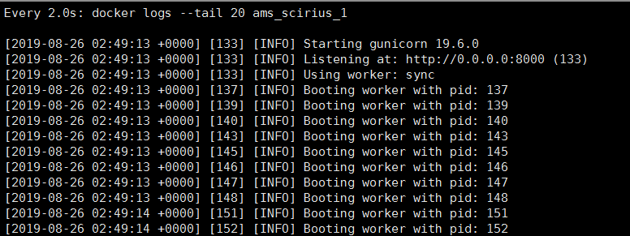
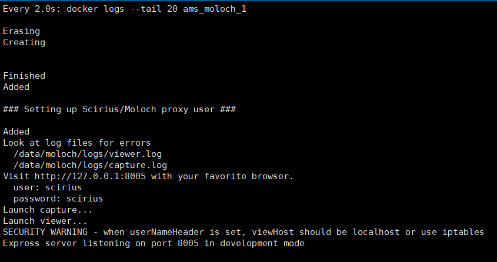
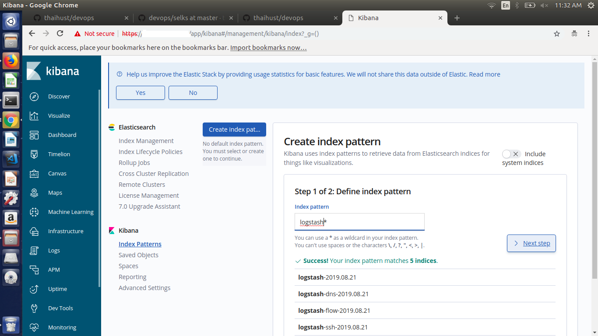

# OS supported: ubuntu 16.04, ubuntu 18.04
# Hướng dẫn build & run SELKS bằng docker
- Bước 1: Setup môi trường docker và python:

  ```
  bash 1-install-docker.sh
  bash 2-python-environment.sh
  ```

- Bước 2: Setup Amsterdam:

  ```
  cd Amsterdam
  python setup.py install
  ```

- Bước 3: Trên thư mục bất kì, generate SELKS docker-compose file và run SELKS stack:

  ```
  amsterdam -d ams -i eth0 setup
  cd ams
  docker-compose up -d
  ```

  Chú ý thay giá trị eth0 bằng card mạng mà suricata muốn sniff

- Bước 4: Kiểm tra cài đặt:
  - Sau khi các container của stack SELKS đã tạo xong, cần phải chờ một khoảng thời gian để scirius và moloch khởi động xong dịch vụ.
  - Kiểm tra trạng thái các docker containers:
   
  ```
  docker ps
  ```
  
  - Mở hai console ssh, dùng lệnh watch để theo dõi hai container scririus và moloch:
  
  ```
  watch -n 2.0 "docker logs --tail 20 ams_scirius_1"
  watch -n 2.0 "docker logs --tail 20 ams_moloch_1"
  ```
  
  - Với scirius, đợi cho tới khi có log thông báo như sau nghĩa là đã khởi tạo xong:
  
  
  
  - Với moloch, đợi cho tới khi có log thông báo như sau nghĩa là đã khởi tạo xong:
  
  

  - Bước 4 là bước khởi tạo databases và setup user cho moloch. Sau khi confirm moloch đã khởi tạo xong, phải tạo lại container moloch mới với tùy chọn không khởi tạo lại database mỗi khi restart container (tránh việc xóa đi các packets đã index trong elasticsearch):
  
  ```
  docker-compose -f moloch.yml up -d
  ```

- Bước 5: Import Elasticsearch visualization, index-pattern, dashboard, search vào stack SELKS theo mục 3 trong hướng dẫn sau: https://github.com/thaihust/devops/tree/master/selks/utilities/elasticsearch

- Bước 6: Truy cập portal scirius: https://_host ip_. Account mặc định access vào scririus: scirius/scirius

- Bước 7: Cấu hình Kibana portal:

  - Trên giao diện scirius, click vào ô Dashboard để mở Kibana dashboard: 

  

  - Trên Kibana dashboard, click vào Discover, Kibana sẽ yêu cầu tạo một Index pattern. Nhập: `logstash*` và click Next step.

  

  - Cấu hình Time Filter là: `@timestamp`. Sau đó click "Create index pattern"

  

  - Click lại vào Discover để xem log:

  

- Bước 8: Truy cập portal moloch: https://_host ip_/moloch

- Bước 9 (optional): Copy các file pcap vào thư mục: ```ams/moloch/tcpdump```. Sau đó thực hiện lệnh sau để import các file pcaps:

  ```
  docker exec -ti ams_moloch_1 bash -c '/data/moloch-parse-pcap-folder.sh'
  ```

# Cấu hình cho moloch

- Moloch không phải là realtime system, moloch chỉ ghi SPI data vào elasticsearch đối với một session sau một khoảng thời gian timeout nhất định kể từ khi session đó đóng. Do đó trong một số trường hợp, có thể mất từ 3-5 phút SPI data mới được ghi vào elasticsearch và hiển thị trên moloch portal. Moloch support cấu hình một số loại session như sau: tcp, udp, sctp, icmp (Chi tiết thông tin các tham số cấu hình: https://molo.ch/settings). Với bộ cài hiện tại (lấy ví dụ theo hướng dẫn cài đặt ở mục trên):

  - Sửa file: ```ams/config/moloch/config.ini```. Dưới section ```[default]```:

  ```
  tcpTimeout = 600
  tcpSaveTimeout = 720
  sctpTimeout = 60
  udpTimeout = 30
  icmpTimeout = 10
  ```
  
  - Restart lại moloch để áp dụng cấu hình: ```docker restart ams_moloch_1```
