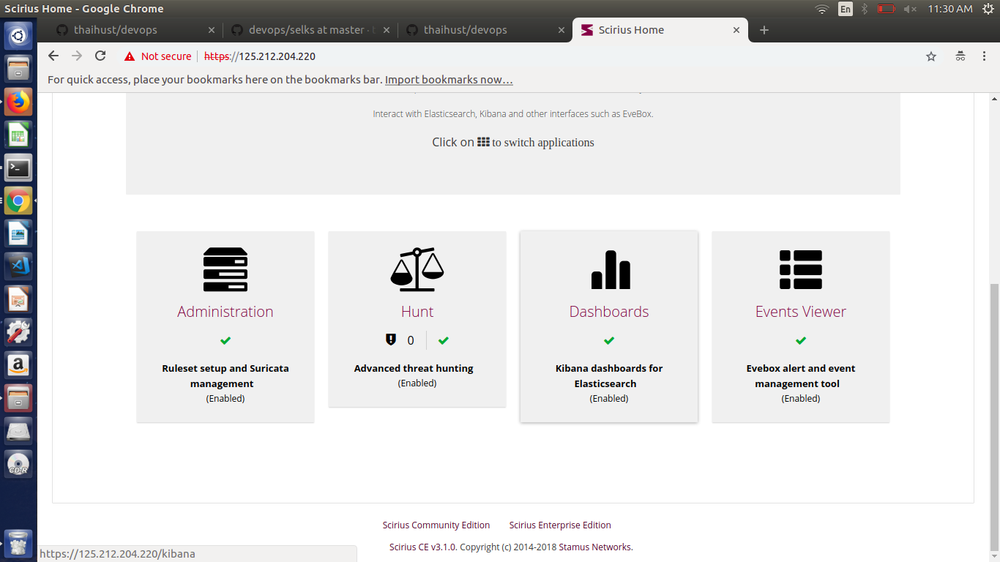
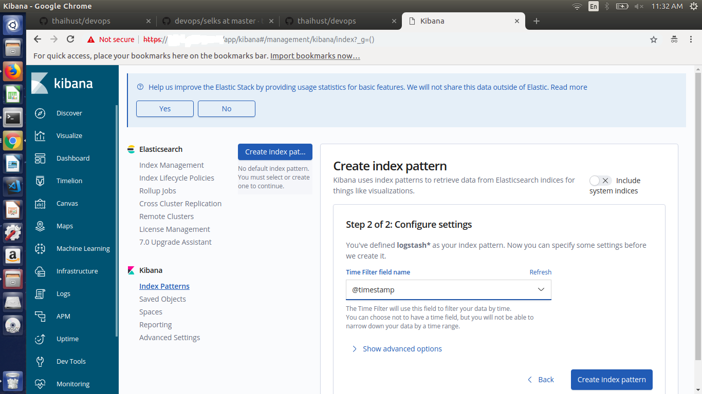
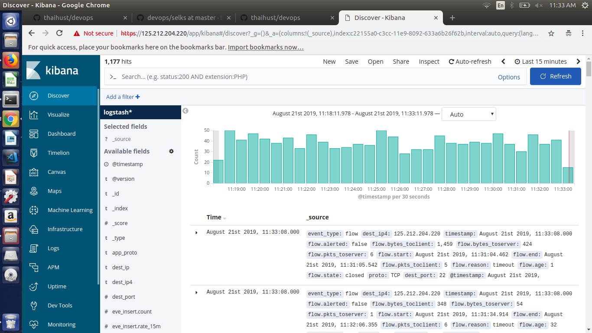

# OS supported: ubuntu 16.04, ubuntu 18.04
# Hướng dẫn build & run SELKS bằng docker
- Bước 1: Setup môi trường docker và python:

  ```
  bash 1-install-docker.sh
  bash 2-python-environment.sh
  ```

- Bước 2: Setup Amsterdam:

  ```
  cd Amsterdam
  python setup.py install
  ```

- Bước 3: Trên thư mục bất kì, generate SELKS docker-compose file và run SELKS stack:

  ```
  amsterdam -d ams -i eth0 setup
  cd ams
  docker-compose up -d
  ```

  Chú ý thay giá trị eth0 bằng card mạng mà suricata muốn sniff

- Bước 4: Import Elasticsearch visualization, index-pattern, dashboard, search vào stack SELKS theo mục 3 trong hướng dẫn sau: https://github.com/thaihust/devops/tree/master/selks/utilities/elasticsearch

- Bước 5: Truy cập portal scirius: https://_host ip_. Account mặc định access vào scririus: scirius/scirius

- Bước 6: Cấu hình Kibana portal:

  - Trên giao diện scirius, click vào ô Dashboard để mở Kibana dashboard: 

  

  - Trên Kibana dashboard, click vào Discover, Kibana sẽ yêu cầu tạo một Index pattern. Nhập: `logstash*` và click Next step.

  

  - Cấu hình Time Filter là: `@timestamp`. Sau đó click "Create index pattern"

  

  - Click lại vào Discover để xem log:

  
